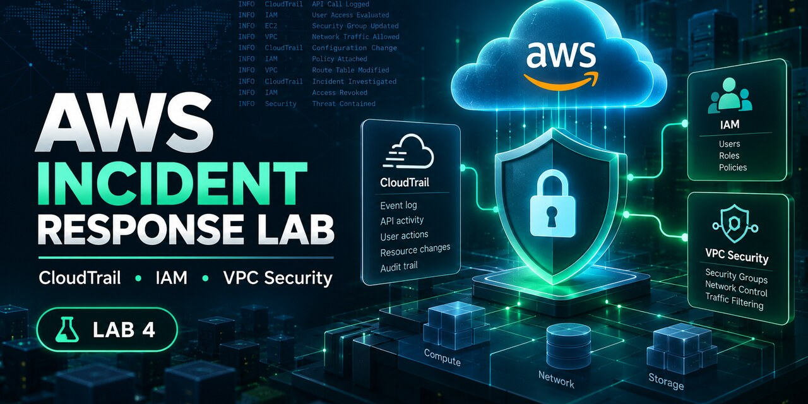
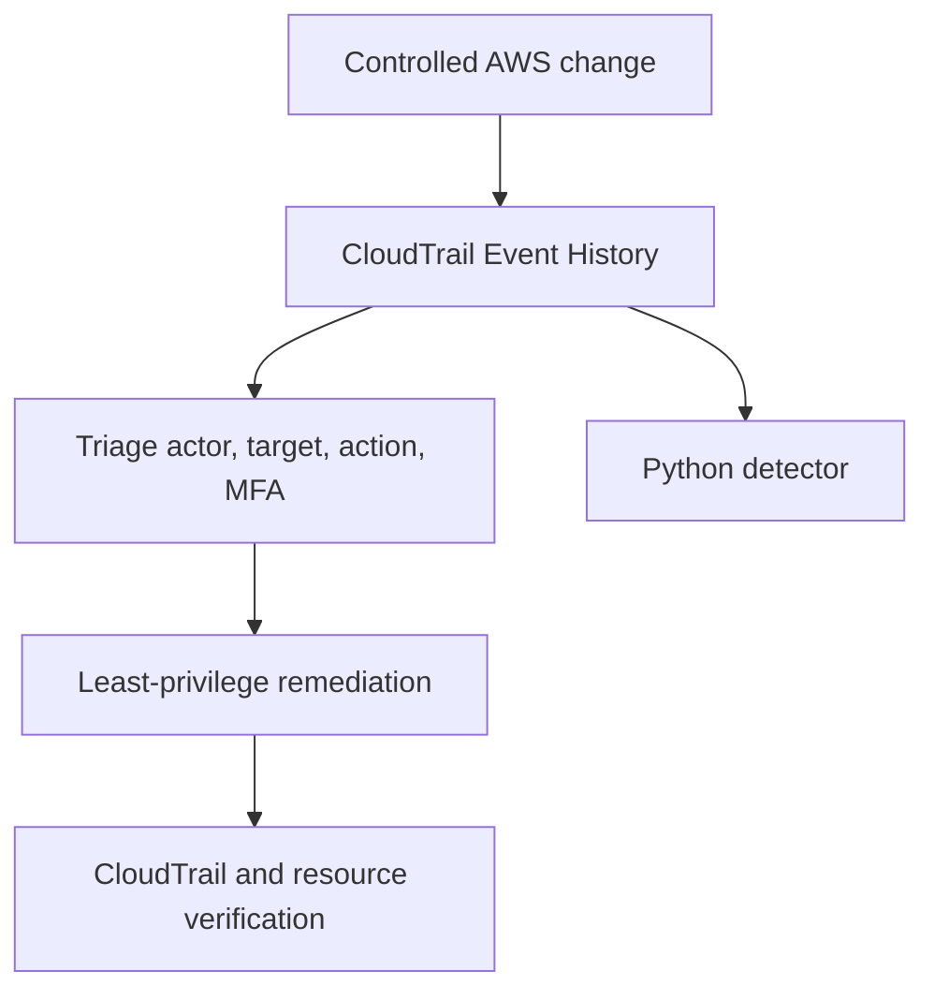
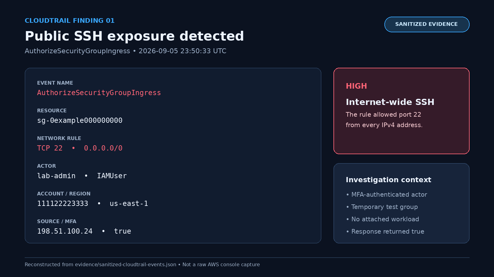
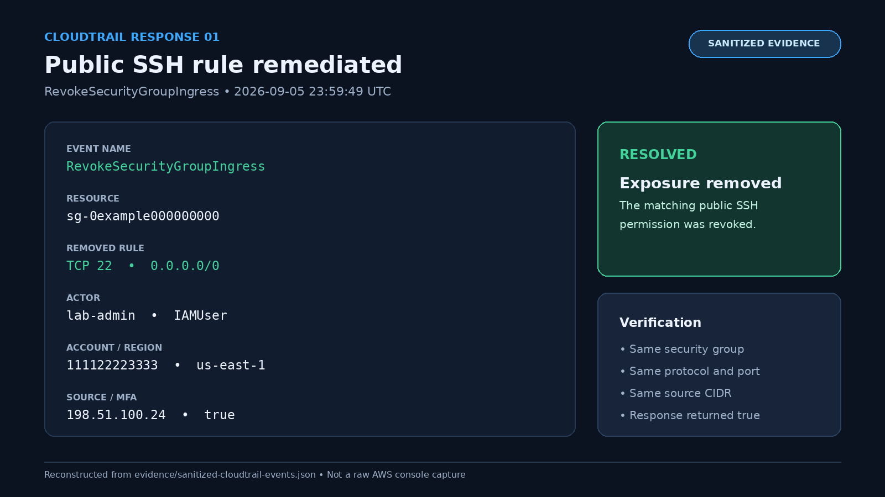
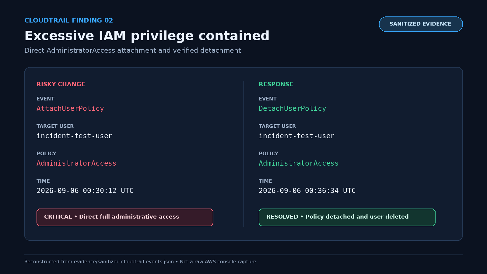

# AWS Security Detection and Incident Response Lab



An AWS security operations lab focused on controlled misconfiguration, CloudTrail investigation, remediation, cleanup, and detection engineering.

## Lab overview

The lab recreates two common AWS security problems in a controlled environment: public administrative access and excessive IAM privilege. Both scenarios were performed in a personal AWS account using an MFA-authenticated IAM administrator. Test resources were deliberately kept unused and temporary, then removed after the investigation and evidence collection were complete.

| Scenario | Risk introduced | CloudTrail evidence | Remediation | Impact |
|---|---|---|---|---|
| Public SSH exposure | `AuthorizeSecurityGroupIngress` allowed TCP/22 from `0.0.0.0/0` | Actor, source, target security group, ports, CIDR, region, and MFA state | Removed the rule and verified `RevokeSecurityGroupIngress` | None—the security group was never attached to a resource |
| Excessive IAM privilege | `AdministratorAccess` was attached directly to `incident-test-user` | `AttachUserPolicy` identified the actor, target user, and policy ARN | Detached the policy and verified `DetachUserPolicy` | None—the test user had no password, keys, group membership, or activity |

After remediation, the current resource state and the corresponding CloudTrail events were checked to confirm that each risky change had been reversed. The temporary IAM user and security group were then deleted, with `DeleteUser` and `DeleteSecurityGroup` providing the final audit-trail evidence.



## Detection engineering

A dependency-free Python detector in `scripts/cloudtrail_detector.py` analyzes CloudTrail JSON and identifies:

- public SSH (22) or RDP (3389) exposure over IPv4 or IPv6;
- direct attachment of high-risk AWS managed IAM policies;
- the corresponding remediation event;
- whether each finding remains `OPEN` or is `RESOLVED`.

Run the detector against the sanitized evidence:

```bash
python scripts/cloudtrail_detector.py evidence/sanitized-cloudtrail-events.json
```

Expected result:

```text
[HIGH] RESOLVED SG-PUBLIC-ADMIN: Public SSH access from 0.0.0.0/0
[CRITICAL] RESOLVED IAM-PRIVILEGED-POLICY: Privileged policy AdministratorAccess attached directly
Summary: 2 risky changes, 0 open, 2 resolved
```

The `--json` option provides machine-readable output. For CI use, `--fail-on-open` exits with code 2 when a risky change remains unresolved.

## Tests

```bash
python -m unittest discover -s tests -v
```

The test suite covers risky and safe network rules, remediation correlation, privileged IAM attachment, and CloudTrail `Records` wrappers.

## Evidence and privacy

`evidence/sanitized-cloudtrail-events.json` reconstructs the events observed during the lab while preserving the details needed for analysis: event names, sequence, timestamps, ports, CIDRs, policies, resources, and remediation relationships. Account numbers, source IP addresses, access-key IDs, ARNs, request IDs, and event IDs were replaced before publication.

Raw AWS console screenshots are intentionally excluded because they contain identifying account and session metadata. No passwords, MFA seeds, secret keys, or session tokens are stored in the repository.

## Sanitized evidence snapshots

The following portfolio-safe images were reconstructed from the sanitized CloudTrail dataset rather than raw AWS console captures. Account numbers, source IPs, security-group IDs, and related identifiers shown in the images are documentation placeholders.

### Public SSH detection



### Public SSH remediation



### Excessive IAM privilege remediation



## Optional Terraform baseline

The root Terraform configuration provides a secure VPC baseline with separate public and private subnets. The intentionally insecure security-group example is isolated in `scenarios/insecure-security-group` and is not referenced by the root module. Terraform was included as an infrastructure-as-code reference and was not deployed during the live investigation.

## Repository layout

```text
.
├── .github/workflows/terraform.yml
├── docs/
│   ├── findings/FINDING-001-public-ssh.md
│   ├── incidents/INCIDENT-001-public-ssh.md
│   ├── incidents/INCIDENT-002-excessive-iam.md
│   └── runbooks/deploy-and-cleanup.md
├── evidence/
│   ├── README.md
│   └── sanitized-cloudtrail-events.json
├── modules/network/
├── scenarios/insecure-security-group/
├── scripts/cloudtrail_detector.py
├── tests/test_cloudtrail_detector.py
└── main.tf
```

## Cost controls

The environment was designed to avoid unnecessary AWS charges while still producing useful security telemetry and investigation evidence.

- CloudTrail Event History was used without creating a paid trail or data store.
- No EC2 instances, NAT gateways, Elastic IPs, load balancers, databases, or log-ingestion pipelines were created.
- The security group remained unattached, and the IAM test user had no credentials.
- Risky permissions were removed immediately after verification.
- All temporary resources were deleted when the lab was complete.

## Security conclusions

- A successful API response does not establish that a change is legitimate; actor, session context, source, target, and intent still need to be correlated.
- MFA strengthens authentication but does not prevent an authenticated administrator from making a risky configuration change.
- Remediation is not complete until both the current resource state and the compensating CloudTrail event have been verified.
- CloudTrail Event History works well for short investigations, while production detection requires centralized logging, alerting, retention, and clear operational ownership.

## Project summary

This project follows an end-to-end AWS security investigation workflow, from introducing controlled configuration risks through CloudTrail analysis, remediation, verification, and cleanup. The same activity was then translated into a tested Python detector capable of identifying the risky changes and determining whether they remain open or have been resolved. Together, the lab demonstrates practical AWS security operations, IAM and network-security analysis, evidence handling, detection engineering, and automation.

## License

MIT—see `LICENSE`.

## Related portfolio labs

[Lab 1: Linux support & troubleshooting](https://github.com/ozangirginwork-wq/linux-it-support-troubleshooting-lab) · [Lab 2: Windows Server & Active Directory](https://github.com/ozangirginwork-wq/windows-server-active-directory-lab) · [Lab 3: Python IT automation](https://github.com/ozangirginwork-wq/python-it-cloud-automation-lab) · [Lab 5: Secure Terraform & CI security](https://github.com/ozangirginwork-wq/terraform-cicd-pipeline) · [Lab 6: AWS automated incident response](https://github.com/ozangirginwork-wq/aws-security-automated-incident-response)

## Detector correlation limits

Failed AWS API calls are ignored as state changes. Ingress revocation must match the original protocol, port range and public CIDR before closing a finding. `RESOLVED` means a matching successful remediation event was observed in the supplied log set; this offline tool does not independently query current AWS state. Rule-ID-only revocations and omitted events require manual investigation.
