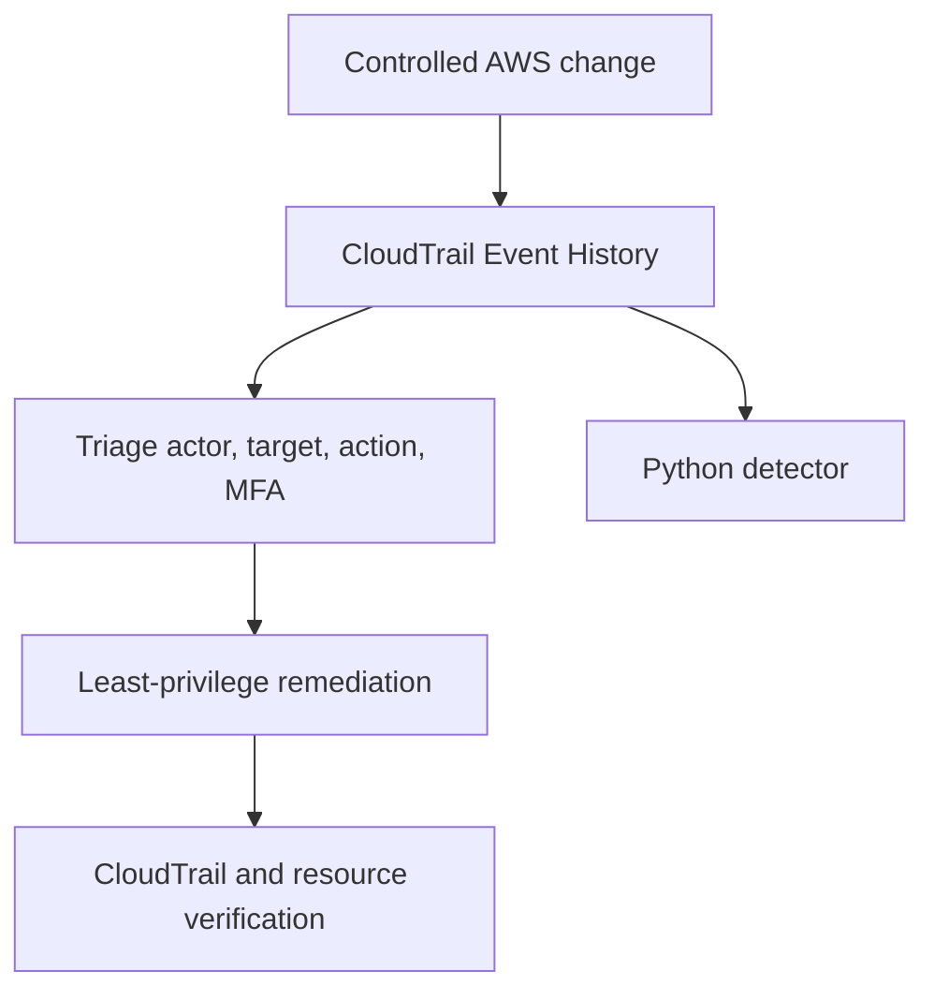

# AWS Security Detection and Incident Response Lab


A $0 AWS security operations portfolio lab demonstrating controlled misconfiguration, CloudTrail investigation, remediation, cleanup, and automated detection engineering.

## Lab overview

Two controlled security scenarios were carried out in a personal AWS lab account using an MFA-authenticated IAM administrator. Only temporary, unused resources were created, and each was removed after the required evidence had been collected.

| Scenario | Risk introduced | CloudTrail evidence | Remediation | Impact |
|---|---|---|---|---|
| Public SSH exposure | `AuthorizeSecurityGroupIngress` allowed TCP/22 from `0.0.0.0/0` | Actor, source, target security group, ports, CIDR, region, and MFA state | Removed the rule and verified `RevokeSecurityGroupIngress` | None—the security group was never attached to a resource |
| Excessive IAM privilege | `AdministratorAccess` was attached directly to `incident-test-user` | `AttachUserPolicy` identified the actor, target user, and policy ARN | Detached the policy and verified `DetachUserPolicy` | None—the test user had no password, keys, group membership, or activity |

After remediation was verified, both temporary resources were deleted and the corresponding `DeleteUser` and `DeleteSecurityGroup` events were confirmed in CloudTrail.



## Detection engineering

The dependency-free detector in `scripts/cloudtrail_detector.py` analyzes CloudTrail JSON and identifies:

- public SSH (22) or RDP (3389) exposure over IPv4 or IPv6;
- direct attachment of high-risk AWS managed IAM policies;
- the corresponding remediation event;
- whether each finding remains `OPEN` or is `RESOLVED`.

Run it against the sanitized evidence:

```bash
python scripts/cloudtrail_detector.py evidence/sanitized-cloudtrail-events.json
```

Expected result:

```text
[HIGH] RESOLVED SG-PUBLIC-ADMIN: Public SSH access from 0.0.0.0/0
[CRITICAL] RESOLVED IAM-PRIVILEGED-POLICY: Privileged policy AdministratorAccess attached directly
Summary: 2 risky changes, 0 open, 2 resolved
```

Use `--json` for machine-readable output. In CI, `--fail-on-open` exits with code 2 if a risky change was not remediated.

## Tests

```bash
python -m unittest discover -s tests -v
```

The tests cover risky and safe network rules, remediation correlation, privileged IAM attachment, and CloudTrail `Records` wrappers.

## Evidence and privacy

`evidence/sanitized-cloudtrail-events.json` is a faithful reconstruction of the events observed during the lab. It preserves event names, sequence, timestamps, ports, CIDRs, policies, resources, and remediation relationships while replacing the account number, source IP, access-key IDs, ARNs, request IDs, and event IDs.

Raw screenshots are intentionally excluded because they contain identifying account and session metadata. No passwords, MFA seeds, secret keys, or session tokens are stored in this repository.

## Sanitized evidence snapshots

These portfolio-safe images were reconstructed exclusively from the sanitized CloudTrail dataset. They are not raw AWS console captures. The account number, source IP, security-group ID, and related identifiers are documentation placeholders.

### Public SSH detection


### Public SSH remediation


### Excessive IAM privilege remediation


## Optional Terraform baseline

The root Terraform configuration provides a low-cost secure VPC baseline with separate public and private subnets. The intentionally insecure security-group example is isolated in `scenarios/insecure-security-group` and is not referenced by the root module. Terraform was not deployed during the live investigation.

## Repository layout

```text
.
├── .github/workflows/terraform.yml
├── docs/
│   ├── findings/FINDING-001-public-ssh.md
│   ├── incidents/INCIDENT-001-public-ssh.md
│   ├── incidents/INCIDENT-002-excessive-iam.md
│   └── runbooks/deploy-and-cleanup.md
├── evidence/
│   ├── README.md
│   └── sanitized-cloudtrail-events.json
├── modules/network/
├── scenarios/insecure-security-group/
├── scripts/cloudtrail_detector.py
├── tests/test_cloudtrail_detector.py
└── main.tf
```

## Cost controls

- Used CloudTrail Event History, which requires no trail or paid data store.
- Created no EC2 instances, NAT gateways, Elastic IPs, load balancers, databases, or log ingestion pipelines.
- Kept the security group unattached and the IAM test user without credentials.
- Removed the risky permissions immediately after verification.
- Deleted every temporary resource and signed out of AWS.

## Security conclusions

- A successful API response does not establish business legitimacy; actor, session context, source, target, and change intent must be correlated.
- MFA strengthens authentication but does not prevent an authenticated administrator from making a risky change.
- Remediation is incomplete until both current resource state and the compensating CloudTrail event are verified.
- CloudTrail Event History is useful for short investigations; durable production detection requires centralized logging, alerting, retention, and ownership.

## Interview summary

This project demonstrates an end-to-end AWS incident-response workflow covering public network exposure and excessive IAM privilege. The investigation correlated management-plane activity in CloudTrail with actor, target, source, and MFA context; each risky change was remediated and verified through its compensating API event. The observed behavior was then converted into a tested Python detector and CI control, with all temporary AWS resources removed after validation.

## License

MIT—see `LICENSE`.
